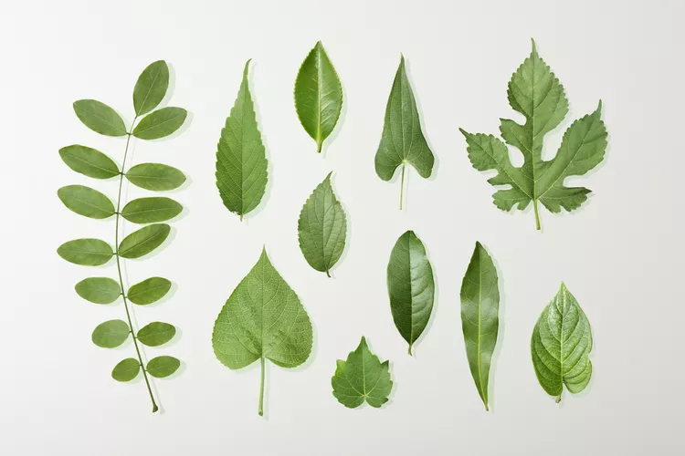
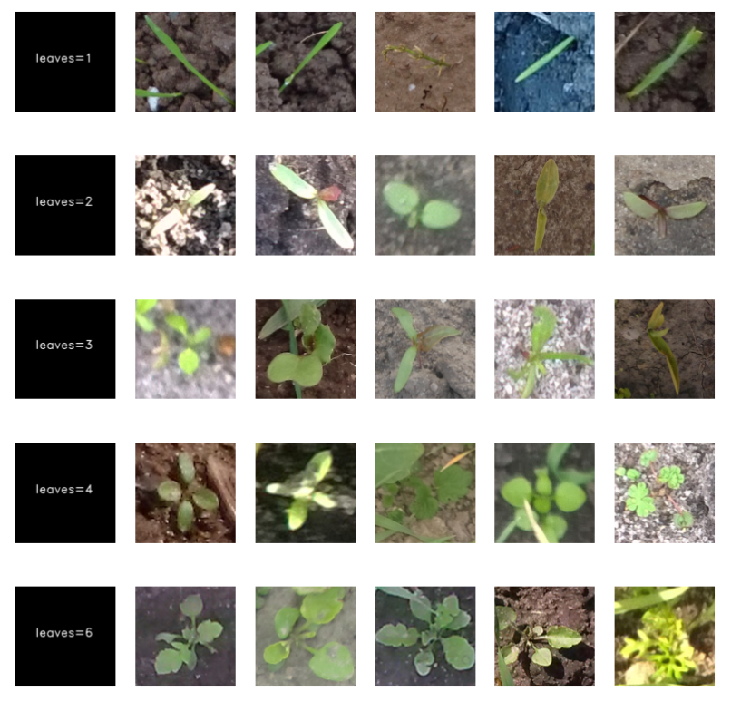
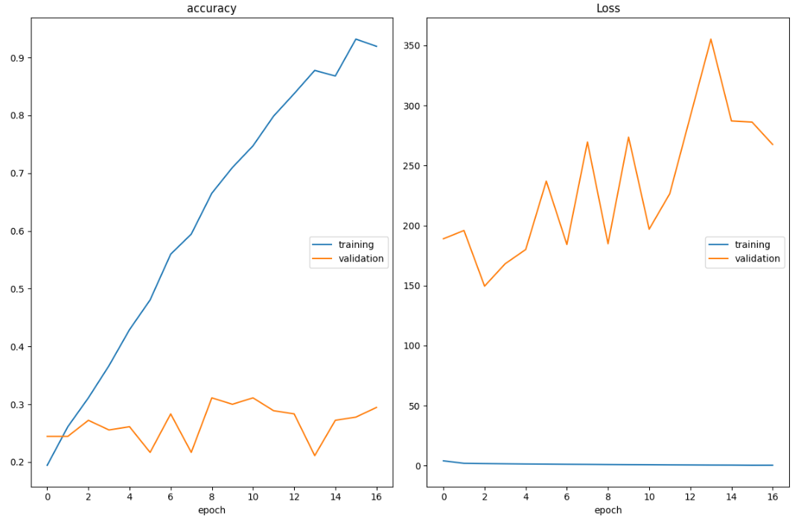
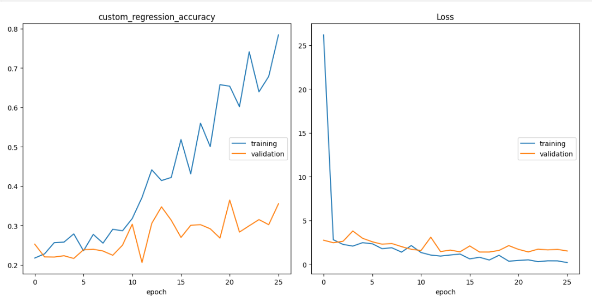
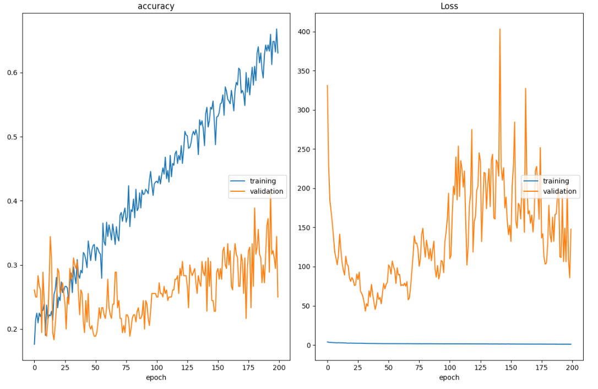
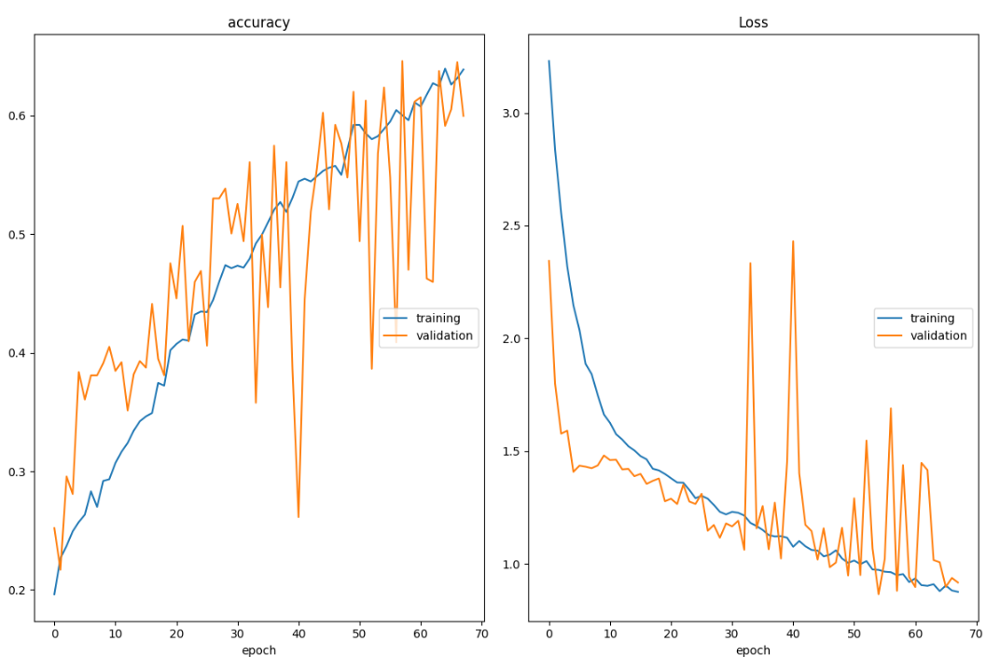

## Plant's Leaf counting using custom model from VGG.

## Overview 
This model aims to count the leaves in the input images and it can count the images that have leaves of 1,2,3,4 or 6.
This problem can be configured as classification or regression problem and here we will compare between these two methodologies.

## Dataset 
**Name** :Leaf counting dataset 
**Description**: The dataset is plant images at different resolutions captured with a variety of cameras. There are images showing plants with approximatelty 1,2,3,4 and 6 leafs. The images are part of a Leaf counting dataset which can be downloaded from the Aarhus University, Denmark. 
**Link to download**:
you can download the dataset from the original website  here<a href="https://vision.eng.au.dk/leaf-counting-dataset/">Original data</a> 
you can download the splitted folders for train and test from here<a href="https://uottawa-my.sharepoint.com/personal/kataa028_uottawa_ca/_layouts/15/guestaccess.aspx?folderid=01bb51fa6429e495e90c0c46aa6a591a4&authkey=AZbk0_V8CN84xcdWH2gGGfk&e=EGRopY">Splitted version</a> 
**To run this notebook, so download the splitted vesion and extract them in the same directory.** 
**Samples from the data**:

## Methods
#### Preprocessing
Perfoming data normalization and resizing to make the images ready for modeling  
According to the problem of detecting the number of leaves so the colors not important to differentiate between the classes, so I converted the dataset to gray scale and try to segment only the planet and remove the background. 
You can download the preprocessed dataset from here <a href='https://uottawa-my.sharepoint.com/personal/kataa028_uottawa_ca/_layouts/15/guestaccess.aspx?docid=0d1efed4e55514e6b969bbb25eebb95c8&authkey=AXTt_Crv-w3FeLKBn0lfo0E&e=V1s7MK'>Download</a>
#### Data Augmentation
To increase the number of images to make the model learn more from the data we performed some augmentation such as flipping, small rotation, shear, random crops and zoom. 

#### Modeling
**Classification** using VGG . 
**Regresssion** also using VGG and customize the last layer to be 1 node linear. 
In the these appraoches I also used some regularization and batch normalization.

## Results
#### Simple VGG Classification without regularization

#### Simple VGG Regression

#### Simple VGG Classification After performing some Regularization

#### Simple VGG Classification After performing regularization and data augmentation.

#### From these results the best model is classification with augmentation and regularization.

#### To download the trained models you can find them here <a href='https://uottawa-my.sharepoint.com/personal/kataa028_uottawa_ca/_layouts/15/guestaccess.aspx?folderid=0b835e66531ca4db789e9b5ba9ce5a58f&authkey=Ae98ZTPJNvewLsT03ZpKZcE&e=PDwmiO'>download</a>

